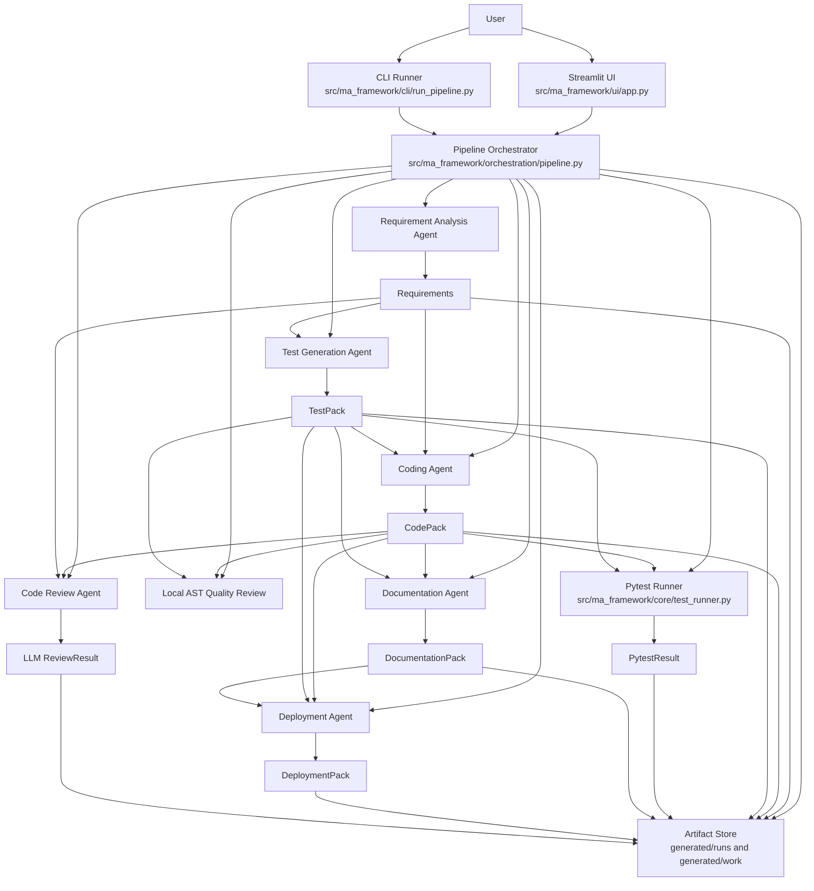

# Architecture Diagram

```mermaid
flowchart TD
    U[User] --> UI[Streamlit UI<br/>src/ma_framework/ui/app.py]
    U --> CLI[CLI Runner<br/>src/ma_framework/cli/run_pipeline.py]

    UI --> P[Pipeline Orchestrator<br/>src/ma_framework/orchestration/pipeline.py]
    CLI --> P

    P --> RA[Requirement Analysis Agent]
    RA --> REQ[Requirements]

    P --> TA[Test Generation Agent]
    REQ --> TA
    TA --> TESTS[TestPack]

    P --> CA[Coding Agent]
    REQ --> CA
    TESTS --> CA
    CA --> CODE[CodePack]

    P --> TR[Pytest Runner<br/>src/ma_framework/core/test_runner.py]
    CODE --> TR
    TESTS --> TR
    TR --> PYTEST[PytestResult]

    P --> LQ[Local AST Quality Review]
    CODE --> LQ
    TESTS --> LQ

    P --> CRA[Code Review Agent]
    CODE --> CRA
    REQ --> CRA
    CRA --> LLMR[LLM ReviewResult]

    P --> DA[Documentation Agent]
    CODE --> DA
    TESTS --> DA
    DA --> DOC[DocumentationPack]

    P --> DPA[Deployment Agent]
    CODE --> DPA
    TESTS --> DPA
    DOC --> DPA
    DPA --> DEPLOY[DeploymentPack]

    P --> ART[Artifact Store<br/>generated/runs and generated/work]
    REQ --> ART
    CODE --> ART
    TESTS --> ART
    PYTEST --> ART
    DOC --> ART
    DEPLOY --> ART
    LLMR --> ART
```
