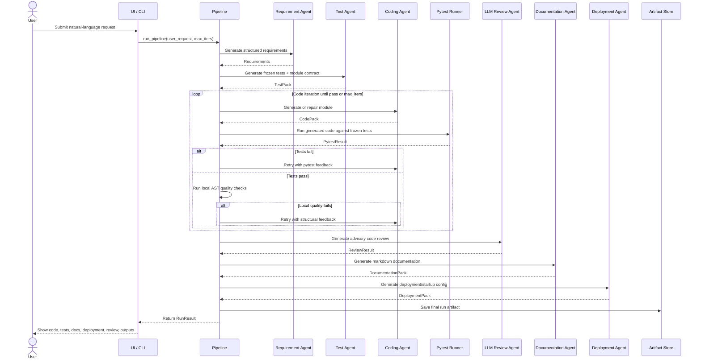

# Pipeline Sequence Diagram

```mermaid
sequenceDiagram
    actor User
    participant UI as UI / CLI
    participant P as Pipeline
    participant Req as Requirement Agent
    participant Test as Test Agent
    participant Code as Coding Agent
    participant Pytest as Pytest Runner
    participant Review as LLM Review Agent
    participant Doc as Documentation Agent
    participant Deploy as Deployment Agent
    participant Store as Artifact Store

    User->>UI: Submit natural-language request
    UI->>P: run_pipeline(user_request, max_iters)

    P->>Req: Generate structured requirements
    Req-->>P: Requirements

    P->>Test: Generate frozen tests + module contract
    Test-->>P: TestPack

    loop Code iteration until pass or max_iters
        P->>Code: Generate or repair module
        Code-->>P: CodePack
        P->>Pytest: Run generated code against frozen tests
        Pytest-->>P: PytestResult
        alt Tests fail
            P->>Code: Retry with pytest feedback
        else Tests pass
            P->>P: Run local AST quality checks
            alt Local quality fails
                P->>Code: Retry with structural feedback
            end
        end
    end

    P->>Review: Generate advisory code review
    Review-->>P: ReviewResult

    P->>Doc: Generate markdown documentation
    Doc-->>P: DocumentationPack

    P->>Deploy: Generate deployment/startup config
    Deploy-->>P: DeploymentPack

    P->>Store: Save final run artifact
    P-->>UI: Return RunResult
    UI-->>User: Show code, tests, docs, deployment, review, outputs
```
